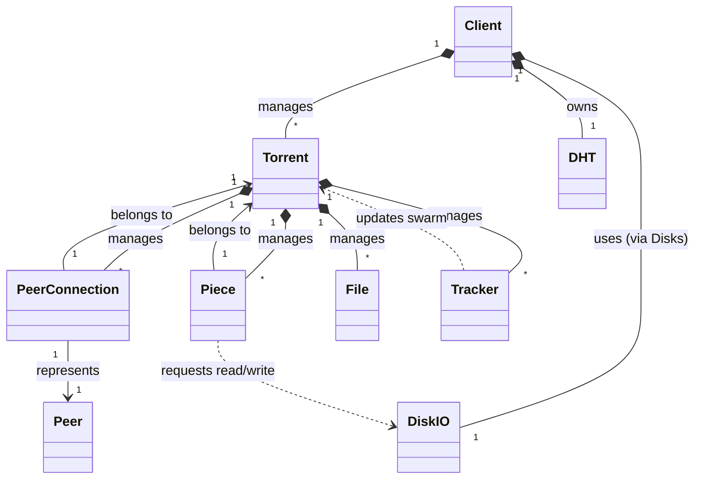

# JSTorrent Core Architecture Analysis

## 1. High-Level Architecture

The JSTorrent core is a pure JavaScript implementation of the BitTorrent protocol, originally designed for Chrome Apps. It follows an event-driven, object-oriented architecture where a central `Client` object manages a collection of `Torrent` objects, which in turn manage their own `PeerConnection`s, `Piece`s, and `Tracker`s.

The I/O layer is heavily tied to Chrome Apps APIs (`chrome.sockets`, `chrome.fileSystem`), but the core logic is reasonably separated into distinct classes.

### Core Components

*   **Client (`client.js`)**: The "God Object" / Root Controller. It initializes the application, manages global state (active torrents, disk mounts), handles incoming TCP connections (listener), and coordinates background tasks (hashing worker, keep-awake).
*   **Torrent (`torrent.js`)**: Represents a single download session. It acts as a state machine (started, stopped, hashing, seeding) and orchestrates the download process by managing peers and pieces.
*   **PeerConnection (`peerconnection.js`)**: Handles the TCP wire protocol with a single peer. It manages the handshake, message parsing/serialization, and flow control (choking/interested states).
*   **Piece (`piece.js`)**: Manages the data for a single torrent piece. It handles block requests, assembly, SHA-1 verification (via worker), and persistence.
*   **DiskIO (`diskio.js`)**: An asynchronous job queue for file operations. It abstracts the complexity of the Chrome FileSystem API (writers, truncation, directory traversal) and prevents UI blocking.
*   **Tracker (`tracker.js`, `udptracker.js`)**: Handles communication with HTTP and UDP trackers to discover peers.
*   **DHT (`dht.js`)**: Implements a basic Distributed Hash Table node for peer discovery without trackers.

## 2. Class Relationships & Data Flow

### Key Interactions

1.  **Download Loop**:
    *   `Torrent` identifies missing pieces (`bitfield`).
    *   `PeerConnection` checks if the peer has the piece (`peerBitfield`).
    *   `PeerConnection` sends `REQUEST` messages for blocks.
    *   Incoming `PIECE` messages are handled by `PeerConnection`, which passes data to `Piece`.
    *   `Piece` assembles blocks. When complete, it sends data to `WorkerThread` for SHA-1 hashing.
    *   If valid, `Piece` triggers a write job via `DiskIO`.

2.  **Disk I/O**:
    *   `DiskIO` maintains a queue of jobs (`PieceWriteJob`, `PieceReadJob`).
    *   It processes jobs sequentially (mostly) to avoid overwhelming the filesystem.
    *   It uses `FileMetadataCache` to avoid frequent `getMetadata` calls.

3.  **Peer Discovery**:
    *   `Tracker` (HTTP/UDP) and `DHT` query external sources.
    *   They populate the `Torrent.swarm` collection.
    *   `Torrent` connects to peers from the swarm as needed.

## 3. Feature Set & Missing BEPs

The engine implements the core BitTorrent protocol (BEP 3) and several extensions.

### Supported Features
*   **BEP 3 (Core Protocol)**: Full implementation (handshake, bitfield, choke/unchoke, piece/request).
*   **BEP 5 (DHT)**: Basic implementation (ping, query).
*   **BEP 9 (Extension Protocol)**: Supported (`ut_metadata`, `ut_pex`).
*   **BEP 10 (Extension Negotiation)**: Supported.
*   **BEP 11 (PEX)**: Peer Exchange supported via `ut_pex`.
*   **BEP 12 (Multitracker)**: Supported (tracker tiers).
*   **BEP 15 (UDP Tracker)**: Supported.
*   **BEP 23 (Compact Tracker Response)**: Supported.
*   **Magnet Links**: Supported (via `ut_metadata` to fetch info dictionary).
*   **Endgame Mode**: Implemented (requests same blocks from multiple peers at end of download).
*   **Web Seeding (BEP 19)**: Not explicitly seen, though `url-list` might be parsed.

### Missing / Incomplete Features
*   **BEP 29 (uTP)**: **Missing**. The engine relies entirely on TCP (`chrome.sockets.tcp`). Implementing uTP would require a userspace UDP transport stack.
*   **BEP 55 (Holepunching)**: **Missing**. No logic for holepunching seen.
*   **Encryption (MSE/PE)**: **Missing**. `protocol.js` explicitly disables crypto (`supportcrypto=0`). This limits connectivity to peers requiring encryption.
*   **IPv6**: **Partial**. Some flags exist, but full end-to-end IPv6 support (especially in DHT and peer connections) seems limited.
*   **Merkle Trees (BEP 30)**: **Missing**.
*   **Super Seeding (BEP 16)**: **Missing**.
*   **Fast Extension (BEP 6)**: **Partial**. Constants exist, but deep logic for `ALLOWED_FAST` handling seems minimal.

## 4. Suitability for Refactoring (Pure TS/JS Engine)

The codebase is a strong candidate for refactoring into a platform-agnostic TypeScript library. The core logic is sound, but the I/O layer needs complete abstraction.

### Refactoring Strategy

1.  **Abstract I/O Interfaces**:
    *   Create `ISocket` interface: Abstract away `chrome.sockets.tcp` and `chrome.sockets.udp`. Implementations for Node.js (`net`/`dgram`), Browser (WebSocket/WebRTC), and Chrome Apps.
    *   Create `IFileSystem` interface: Abstract away `chrome.fileSystem`. Implementations for Node.js (`fs`), Browser (OPFS), and Chrome Apps.

2.  **Decouple `Client`**:
    *   The `Client` class is too coupled to the UI and Chrome runtime. Break it down into a `SessionManager` that only handles the engine.

3.  **Modernize JavaScript**:
    *   Convert `prototype` based classes to ES6 `class`.
    *   Use `Promise` / `async/await` instead of callback hell (especially in `diskio.js`).
    *   Type everything with TypeScript.

4.  **Remove Global State**:
    *   Remove reliance on `window.jstorrent` and global `app` objects. Pass dependencies via constructors.

### Recommendation
The architectural patterns (Piece/Peer/Torrent separation) are standard and good. You can reuse the *logic* of `torrent.js`, `peerconnection.js`, and `piece.js`, but you will essentially be rewriting the *implementation* to use modern TS and abstract I/O.

**Verdict**: **Adaptable**. Use the existing logic as a reference specification, but rewrite the implementation to fit the new abstract interfaces. Do not try to "port" it line-by-line; instead, port the *behavior*.
